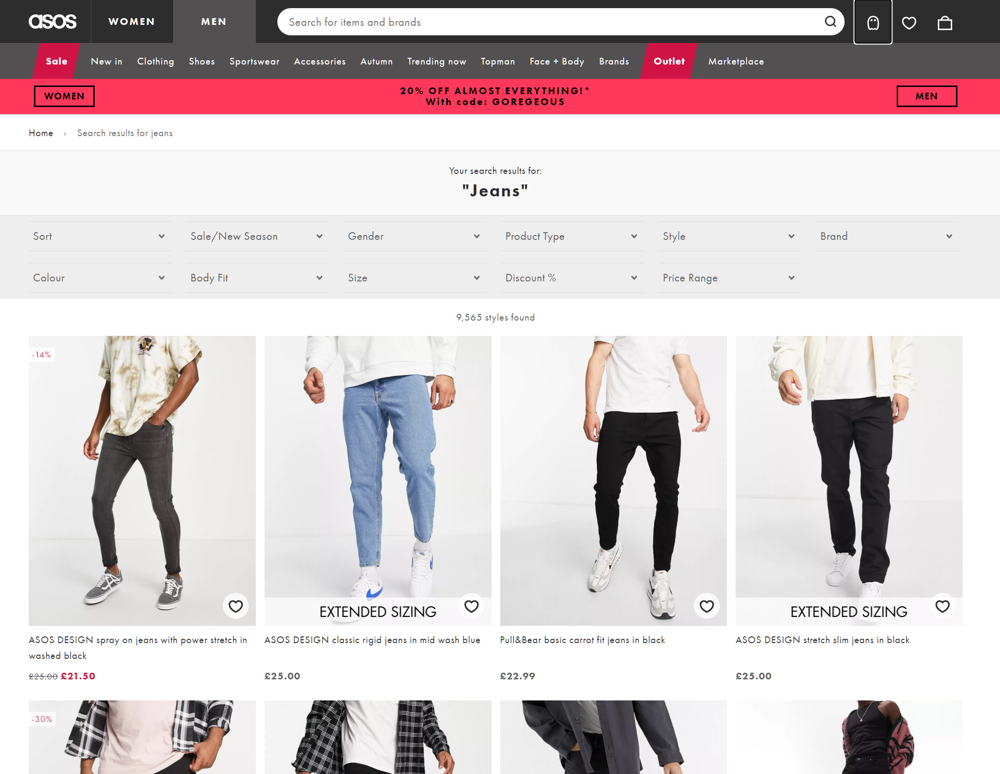
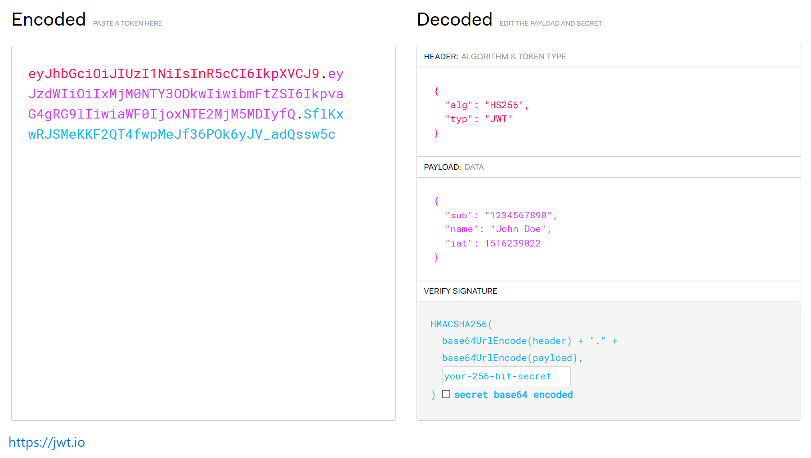

<!-- _class: black -->

# Back to front
## Backend technologies for the frontend developer

---

<!-- _class: white -->

# Who am I?

# Savvas Dalkitsis 
### (he/him)
## Principal Software Engineer @ASOS

---

<!-- _class: black -->
<!-- _footer: "" -->

# ASOS

<!--
Our vision is to be the world’s number one fashion destination for fashion-loving 20-somethings.
-->

---

<!-- _class: white -->

# Why am I here?

<!--
Why are we here?
Do we need this talk?
Let's look at technologies we might be familiar with.
-->

---

<!-- _class: white -->

<iframe src="inlines/word-cloud-android.html" height="80%" width="100%" frameBorder="0"></iframe>

<!--
There's probably no one here that hasn't heard all of these words.
But...
-->

---

<!-- _class: white -->

<iframe src="inlines/word-cloud-backend.html" height="80%" width="100%" frameBorder="0"></iframe>

<!--
How many of you have heard some of these ones?
-->

---

<!-- _class: black -->

# So what?

<!-- 
You might be asking yourself: why do I need to know any of that? I build apps for a living.
-->

---

<!-- _class: white -->

##### Source: cartoonresource/Adobe Stock

## Language barriers are real in tech too.

Progressing your career means being able to have meaningful discussions with people outside your domain and comfort zone.

A basic understanding of their language is paramount.

<!--
How frustrating is when you speak with coworkers that do not understand the constraints and architecture of mobile development?
-->

---

<!-- _class: white -->

# Let's start

<!--
Grouping technologies in vague categories, might overlap or reference each other.

Let's start with something that is quite close to our mobile development world and is a must know imo for any senior mobile developer.
-->

---

<!-- _class: black -->

# Caching

There are only two hard things in Computer Science: cache invalidation and naming things.

> Phil Karlton

<!--
(reference interview experience here)
-->

---

<!-- _class: white -->
## Caching
# Expiry headers

<!--
Admitedly the most important thing to know, especially as a front end developer.
-->

---

<!-- _class: white -->

<iframe src="inlines/caching-expiry-1.svg" height="80%" width="100%" frameBorder="0"></iframe>

<!--
Fairly standard flow for loading cachable resources in your app (like images).

Hopefully you are all familiar with it. 
-->

---

<!-- _class: white -->

<iframe src="inlines/caching-expiry-2.svg" height="80%" width="100%" frameBorder="0"></iframe>

<!--
What about this step? A naive implementation would keep resources cached for ever, or for x amount of days or keep a max amount of items in it evicting older items etc.

Lots of eviction strategies, depending on your usecase.

Most are the wrong choice for every day api use (especially for images).

Inflexible for most scenarios. Avatar images should be cached longer than product images for example.

Can't build general purpose caching solution with a fixed strategy.

So what do we do?
-->

---

<!-- _class: white -->

## Caching
# Server side controlled expiry

<!--
Let the server decide. The server you are loading the resource from (an image for example), knows how long you should keep the image for before asking for a new one (is it an avatar image? Keep it for a day max. Is it a product image? keep it for a week.)
-->

---

<!-- _class: white -->

## Caching
# Server side controlled expiry
### `Expires` header

> Example `Expires: Wed, 21 Oct 2015 07:28:00 GMT`

<!--
Simplest directive the server can send in the http response headers. Tells you when the resourcec is deemed expired and you should try re-fetching it again

-->

---

<!-- _class: white -->

## Caching
# Server side controlled expiry
### `Cache-Control` header

> Example `Cache-Control: max-age=604800`

<!--
A newer, much more versatile header, overriding the Expires one, which lets the server AND the client make informed decisions about resource expiry.

The most common directive under this header is max-age, which is a dynamic value, giving you the remaining time for the resource to be treated as not stale.

-->

---

<!-- _class: white -->

The following table lists the standard Cache-Control directives:

Request|Response
-------|--------
max-age|max-age
max-stale|-
min-fresh|-
-|s-maxage
no-cache|no-cache
no-store|no-store
no-transform|no-transform
only-if-cached|-

Request|Response
-------|--------
-|must-revalidate
-|proxy-revalidate
-|must-understand
-|private
-|public
-|immutable
-|stale-while-revalidate
stale-if-error|stale-if-error

_

> ##### https://developer.mozilla.org/en-US/docs/Web/HTTP/Headers/Cache-Control

<!--
There are MANY other directives that we won't go into here. Please do go to the site linked and read about them as they are very useful.

Two points to highlight:

1st, the client can send expiry headers too, indicating its desire for things like (only give me this image if you don't have it already cached etc)

2nd, the stale-if-error header is particularly important for client SDKs to support as you can ask for a stale version in your cache if there is a network error while trying to get a fresh one from the server.

Speaking of fresh resources...

-->
---

<!-- _class: white -->
## Caching
# ETags

<!--
Show of hands, who knows or has heard of ETags?
-->

---

<!-- _class: white -->

## What is an ETag?

The ETag (or entity tag) HTTP response header is an identifier for a specific version of a resource. It lets caches be more efficient and save bandwidth, as a web server does not need to resend a full response if the content was not changed. 

> https://developer.mozilla.org/en-US/docs/Web/HTTP/Headers/ETag

<!--
Blah blah blah. Technical definitions are so boring. What is it actually and why do I care?
-->

---

<!-- _class: white -->

# ETag = Unique Resource ID

> Example `ETag: "33a64df551425fcc55e4d42a148795d9f25f89d4"`

<!--
ETags enable two very common usecases.

Mid flight collision resolution and stale resource refreshing.

Let's look at stale resource refreshing first.
-->

---

<!-- _class: white -->

<iframe src="inlines/caching-expiry-3.svg" height="80%" width="100%" frameBorder="0"></iframe>

<!--
Looking at the earlier example, if the cache tells us the resource exists but has expired we can get the ETag for it from the cache and ask the server to load the resource only if it hasn't changed using the If-None-Match request header. If the resource is still the same remotely, we don't have to download it again and the server responds with a 304 Not Modified and the new expiry headers so we can simply refresh the resource in our cache.

This saves on data and speed benefits for the client and traffic cost for our backend.

Note that we can also choose to always call the server even if our local cache hasn't expired which will allow us to pre-emptively update our local copy if the server side version changed before we were told to expect it
-->

> Example `If-None-Match: "33a64df551425fcc55e4d42a148795d9f25f89d4"`

---

<!-- _class: white -->

## ETag
# Mid air conflicts

<!--
Ever wonder what happens when both you and a coworker press submit when you edit a wiki page at the same time?
-->

---

<!-- _class: white -->

<iframe src="inlines/caching-etag-1.svg" height="80%" width="100%" frameBorder="0"></iframe>

<!--
Two clients submit changes to a resource before the server can process the first one

(can also cause issues even the 2nd comes after the first is processed if they changed the same bit of information)

Solution?
-->

---

<!-- _class: white -->

<iframe src="inlines/caching-etag-2.svg" height="80%" width="100%" frameBorder="0"></iframe>

> Example: `If-Match: "33a64df551425fcc55e4d42a148795d9f25f89d4"`

<!--
If-Match header. Server returns 412 Precondition Failed to the second client who can show an error message to refresh the content 
-->

---

<!-- _class: white -->

## Caching
# CD-eh?

<!--
Show of hands, who know what a CDN is?
-->

---

<!-- _class: white -->

<iframe src="inlines/caching-cdn-1.svg" height="80%" width="100%" frameBorder="0"></iframe>

<!--
CDN (content delivery network) is a service that caches your server content for client consumption.

When a client asks for a resource that you know won't change frequently you can let a CDN keep hold of it and deliver it to client, reducing trafic to your servers, reducing operational cost (scale and db transactions)

Images are the most commonly CDN'ed content but also static files like web scripts etc.

Also, very importantly, it can cache web content for you.
-->

---

<!-- _class: white -->

## Caching
# Server side rendered pages

<!--
What happens when you load a web page?

You get it from a server right?

What do you get?
-->

---

<!-- _class: white -->

<!--
Does the server return everything as a fully rendered html when you search for jeans?

What happens when you scroll to the bottom and auto load more items?

Does the client fetch the data and dynamically update the webpage using js?

We do both. Why?

Cost. DB access (via another api call down the line) is costly. Most people searching for jeans will only see the first page of results. We server side render those and our CDN caches it. When some people scroll, they load more data from our services as needed (which might also be cached in other ways)
-->

---

<!-- _class: white -->

## Caching
# Multilayered caching 

<!--
As it's hopefully by now, caching is an integral part of how we build applications across the entire stack. 

It lives on many layers and being aware of them and how they expire is very important.
-->

---

<!-- _class: white -->

<iframe src="inlines/caching-multilayered.svg" height="90%" width="100%" frameBorder="0"></iframe>

<!--
Server sided in memory caching can be as simple as literally an in memory data structure like on clients or something more full featured like Redis, Memcached etc 
-->

---

<!-- _class: black -->

# Web Application/API Design

<!--
Now for a brief overview of web api technologies and practices you should all be aware of.
-->

---

<!-- _class: white -->

## Web Application/API Design
# REST

> Give it a REST

<!--
I'm sure most of you are familiar or have at least heard of the term REST.

It stands for representational state transfer
-->

---

<!-- _class: white -->

## REST is a set of architectural constraints, not a protocol or a standard. API developers can implement REST in a variety of ways.

> https://www.redhat.com/en/topics/api/what-is-a-rest-api

<!--
Given that it's not a hard set of requirements you will hear lots of opinions on what is best and proper.

I won't focus on the ideology behind each approach.

Rather, focus on the practical reasons why some things should be implemented a certain way.
--> 

---

<!-- _class: white -->

## Web Application/API Design
# HTTP Verbs

> Oh CRUD

---

<!-- _class: white -->

# Does this look familiar?

`https://my.awesome/api/people/1/addAddress`
`https://my.awesome/api/people/1/getAddress`
`https://my.awesome/api/people/1/changeAddress`
`https://my.awesome/api/people/1/deleteAddress`

---

<!-- _class: white -->

# 🤦‍♂️

`https://my.awesome/api/people/1/``add``Address`
`https://my.awesome/api/people/1/``get``Address`
`https://my.awesome/api/people/1/``change``Address`
`https://my.awesome/api/people/1/``delete``Address`

<!-- 
Don't do this. If you see an api like this in your company or project you work on, try to gently promote good API designs by suggesting this instead:
-->

---

<!-- _class: white -->

## HTTP verbs, REST resources nouns

`POST` `https://my.awesome/api/people/1/` `address`
`GET` `https://my.awesome/api/people/1/` `address`
`PUT` `https://my.awesome/api/people/1/` `address`
`DELETE` `https://my.awesome/api/people/1/` `address`

<!--
One endpoint (easier to grok).

REST resources are nouns, http verbs are verbs.

As mentioned earlier this is not ideology, there's a practical reason to do this too.

Lots of middleware has built in rules on how to handle GET,PUT,POST and DELETEs that might trip your APIs up if implemented wrong. (more info about this in a bit)
-->

---

<!-- _class: white -->

## Web Application/API Design
# Query parameters

> http://i.already/know?about=those

<!--
We all know about query parameters.

Did you know they can be a security risk?
-->

---

<!-- _class: white -->

## TL;DR;

If you ever see this in your api:

> https://something.or.other/login?username=rick&password=pickle

😱 from the mountaintops

<!--
While the query part of a url is encrypted in transit during an https transaction, rendering them hidden from MIM attacks, middlewear WILL most likely be logging the whole url including the query param somewhere in your stack thus leaking user credentials in plain text.

This HAS happened in reality out there in a fintech company that I won't mention for obvious reasons but was thankfully caught quickly and fixed.

ALWAYS transmit sensitive (or PII) information in the HTTP headers or body.
-->

---

<!-- _class: white -->

## Web Application/API Design
# JWT

> wtj?

<!--
Json Web Tokens are encoded and SIGNED pieces of data used to transmit sensitive pieces of data securly across services and clients
-->

---

<!-- _class: white -->

<!--
Too big of a topic to go in detail here but what you should know is there are two main types of web tokens, encrypted and signed.

Signed are the tokens you will most commonly encounter. They can be read by anyone who has access as they are simple base64 encoded jsons.

They contain a signtature used by the clients to verify that the JWT was indeed sent by who claims to have sent it.

In the payload you can basically have anything you want (as well as some required parameters) but most relevant to our discussion, you can have OPTIONAL expiry information. 

Thus the JWTs can be checked for staleness without any dependency
-->

---

<!-- _class: white -->

## Web Application/API Design
# OAuth

> oh oh ffff...

<!--
Most here will have heard of OAuth but might be intimidated by it. I know I used to be.

I want to give you a short description of how it works in practice so you are no longer intimidated.
-->

---

<!-- _class: white -->

## Why OAuth?

Remember this?

> https://something.or.other/login?username=rick&password=pickle

<!--
Security is all about reducing attack vectors.

Even if you send your credentials via headers or body as explained earlier, you still want to avoid sending them multiple times for each authenticated call you need.

You want to reduce the amount of times sensitive information is transmitted across the wire as much as possible.

So instead you get given a token that authenticates you and, more importantly, has a short life.

Enter OAuth
-->

---

<!-- _class: white -->

<iframe src="inlines/web-api-design-oauth-1.svg" height="90%" width="100%" frameBorder="0"></iframe>

<!--
OAUth isn't magic.

You still need to send your username and password to the server but only need to do it once (or VERY rarely in certain scenarios)

Once you login you get a relatively long lived refresh token (JWT) which you store locally.

You use that to get a short lived access token (JWT) and save that too (note that most of the time you will get the access token with the refresh token in the previous call)

Whenever you want to make an api call that requires user authentication you use your short lived access token thus limiting the attack vector if that token gets somehow stolen as it only lives for a short while.

(there are some other oauth flows but this is the most common and advisable one to use)
-->

---

<!-- _class: white -->

<iframe src="inlines/web-api-design-oauth-2.svg" height="90%" width="100%" frameBorder="0"></iframe>

<!--
The beauty of JWTs is that you can locally check if the access token has expired so you don't need to even check with the server yourself.

If the access token has expired you use the refresh token you saved before to get a new one.

Thus, the slightly riskier refresh token is exposed less frequently to the network limiting the attack vector even more.
-->

---

<!-- _class: white -->

<iframe src="inlines/web-api-design-oauth-3.svg" height="90%" width="100%" frameBorder="0"></iframe>

<!--
Last, using tokens allows the server to selectively invalidate tokens when it deems it a security risk (in the case of a leak for example).

This also allows you to implement the 'log me out of all devices' feature you may have seen in some apps.

Lastly, in some scenarios the refresh token itself may have expired, or you may get a 401 unauthorised response when trying to refresh your access token.

In that scenario, you will have to ask the user to provide their credentials again and do the whole flow once more
-->

---

<!-- _class: white -->

## Web Application/API Design
# Idempotency

<!--
What happens if you go through a tunnel after just pressing buy on your very expensive purchase?

What if the server has received your order but before it could say so, you lost signal so your app says 'please retry again'?

Will you place a second order costing your user lots of money?
-->

---

<!-- _class: white -->

<!--
Thankfully I don't work in an app with purchases! I don't have to worry about this sort of thing.

Think again.

Duplicate transactions can cause problems in general. Posting the same tweet twice in a row for example.

How do you solve this?
-->

---

<!-- _class: white -->

## ETags 2 - Return of the UUID?

<!--
Not exactly.

Similarly to what we used ETags for earlier, the solution is quite simple. 

Each transaction should be accompanied by a unique identifier, preferably a UUID, so that the server can decide what to do with follow up duplicate calls.

Depending on your usecase the server will tell you that it accepted the call implying it was already accepted earlier or simply tell you that it succeeded as if it was the first time it saw it.

From your point of view, you performed your transaction as intended and it only happened once.
-->

---

<!-- _class: white -->

If we follow the REST principles in designing our APIs, we will have automatically idempotent REST APIs for GET, PUT, DELETE, HEAD, OPTIONS, and TRACE methods. Only POST APIs will not be idempotent.

`POST` is NOT idempotent.
`GET`, `PUT`, `DELETE`, `HEAD`, `OPTIONS` and `TRACE` are idempotent.

> https://restfulapi.net/idempotent-rest-apis/

<!--
Lots of caveats that we don't have time to go over here. Please do read up on this on your own time as it's quite interesting.
-->

---

<!-- _class: black -->

# Service topology

<!--
Now that we know how to talk to our services, let's quickly talk about where those messages actually go.

Think topology=shape if that word sounds intimidating
-->

---

<!-- _class: white -->

# Containers!

<!-- _footer: "Photo by <a href='https://unsplash.com/ja/@carrier_lost?utm_source=unsplash&utm_medium=referral&utm_content=creditCopyText'>Ian Taylor</a> on <a href='https://unsplash.com/s/photos/containers?utm_source=unsplash&utm_medium=referral&utm_content=creditCopyText'>Unsplash</a>"
-->

<!--
What physical containers did for world trade, digital containers did for application deployment.

World trade works as fast as it does cause regardless of what you are trying to ship, you package it in the same shape container and ships know how to quickly load and unload those, not caring what's inside.

Similarly, regardless if your server app is written in Java, Kotlin, Swift, python or C, container runtimes know how to deploy it and route traffic to it not caring what's inside.
-->

---

<!-- _class: white -->

<!--
You may have heard of these terms thrown around but weren't sure what they mean.

We obviously don't have the time to dive into them in detail but as a brief explanation:

Docker and containerd are container runtimes. They are the software that knows how to run the container you packaged your software in.

kubernetes (from the greek κυβερνήτης) is a container orchestration tool. It basically knows how to take your containers and put them on remote servers to run and manages the intercommunication between them.
-->

---

<!-- _class: white -->

## Service topology
# Microservices

---

<!-- _class: white -->

<iframe src="inlines/service-topology-microservices-monolith.svg" height="80%" width="100%" frameBorder="0"></iframe>

<!--
This might look familiar. It's, very vaguely, how we build a native app. One binary, that contains all the logical components of our app. The database, the business logic, the network layer, the view etc.

It's what we call a monolith.

If something in any of these parts crashes, the whole application crashes.

This used to be how services were built not that long ago (still do in many cases)
-->

---

<!-- _class: white -->

<iframe src="inlines/service-topology-microservices-micro.svg" height="80%" width="100%" frameBorder="0"></iframe>

<!--
This is a VERY vague idea of how microservices work.

Each logical part is deployed separately and as such, can be versioned independently, built by different teams, and most importantly, fail independently.

If the search API fails, the website doesn't crash, you just can't perform a search.

You have partial service degradation.
-->

---

<!-- _class: white -->

<iframe src="inlines/service-topology-microservices-micro-regions.svg" height="40%" width="100%" frameBorder="0"></iframe>

<!--
You can also deploy more than one instance of each microservice for redundancy and in different regions of the world too!

This increases speed for local customers and provides an extra safety net in case the network in one region of the world fails.

But how do you know which instance of the service to talk to?
-->

---

<!-- _class: white -->

## Service topology
# DNS

<!--
A Domain Name System is a server that you ask to map domain names to IPs. You use a DNS every day when you go to google.com or twitter.com

Using DNS we can route traffic from a specific region of the world to the instance of the servers in that region of the world.

If we have an incident and that region fails, we can change our DNS to point to another region in the world and the service has no downtime.

That's a lot of domains-> IPs to manage!!
-->

---

<!-- _class: white -->

## Service topology
# Clusters

<!--
A cluster is basically a collection of servers running together, usually under the same physical location, and importantly, under a local internal DNS that knows how to talk to each of the instances inside it.

So when we have to perform a DNS failover to another region for example, we only have to change one (more or less) DNS entry to the new cluster.

If the two clusters in each region are shaped the same (have the same topology), then everything magically works.

How?
-->

---

<!-- _class: white -->

## Service topology
# Traffic Managers / Ingress controllers

---

<!-- _class: white -->

`https://my.awesome.service/home`

`https://my.awesome.service/product/123`

`https://my.awesome.service/search?q=jeans`

<!--
A traffic manager is a piece of software that knows how to direct traffic to different places.

Instead of having to know the ip of each service in the above list, we only need to know the ip of the cluster.

Inside the cluster a traffic manager, or ingress controller, receives all the above requests and based on rules defined when we deploy our services, knows the internal ip of each service to route the traffic to.
-->

---

<!-- _class: white -->

## Load balancers

> Image by <a href="https://pixabay.com/users/peggy_marco-1553824/?utm_source=link-attribution&amp;utm_medium=referral&amp;utm_campaign=image&amp;utm_content=1010888">Peggy und Marco Lachmann-Anke</a> from <a href="https://pixabay.com//?utm_source=link-attribution&amp;utm_medium=referral&amp;utm_campaign=image&amp;utm_content=1010888">Pixabay</a>

<!--
A load balancer is a special type of traffic manager that evenly distributes traffic across multiple instances of the same service (you can of course configure different routing rules if you need)

Why would you want that?

If 10000 users hit your service or site every second, you don't want only one machine to handle all that traffic. You can deploy 10-20 of the same service and split the traffic between them.

What about my data?!
-->

--- 

<!-- _class: white -->

## Service topology
# Multi-primary replication

<!--
A method for data replication across different databases.

This allows multiple instances of a database server to (eventually) contain the same data without having only one of them be the ultimate source of truth.

This is a deep topic which we don't have time to explore but the idea is that this allows you to have fast write speeds from your services all across the world (talking to a local db), without having to sacrifice data consistency.

So complicated, how do we make sure it all works?
-->

--- 

<!-- _class: white -->

 # Chaos 🐵

 <!--
 A practice, followed by many companies, to purposefully throw a spanner in the works of your infrastructure to see how it behaves under strain and failures.

 Randomly bring down services, parts of clusters, or whole regions as a normal part of BAU so that you are always resilient.
 -->

---

<!-- _class: black -->

# Honorable mentions

---

<!-- _class: white -->

* Edge workers
* Functions
* Message queues - Event Driven Architecture
* Optimistic Locking
* Eventual Consistency
* NoSQL
* Non blocking IO
* Round Robin
* Encryption at rest/In transit - End to End Encryption
* Salting
* Eventual Consistency

 ---

<!-- _class: black -->

# Q&A

## Raffle

## Slides

##### https://github.com/ASOS/presentation-back-to-front

